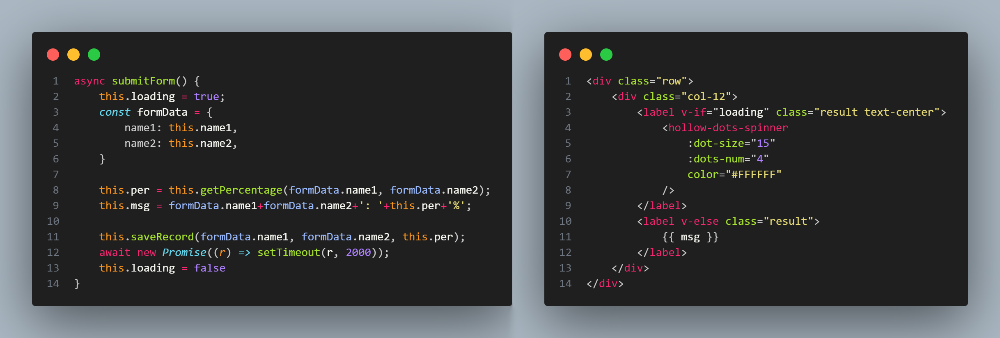
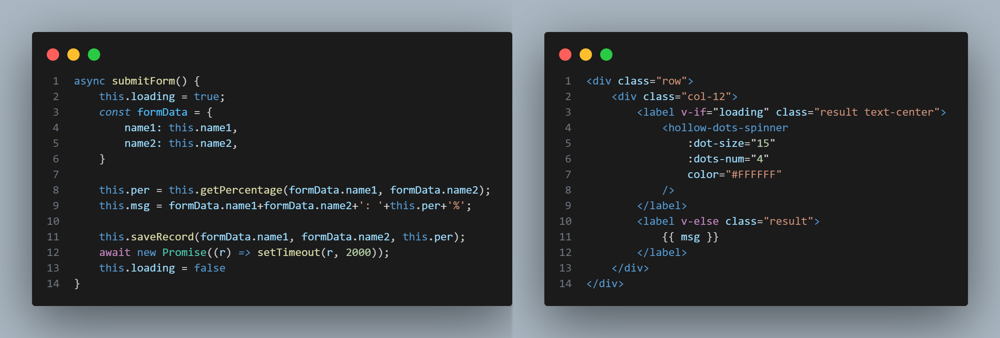
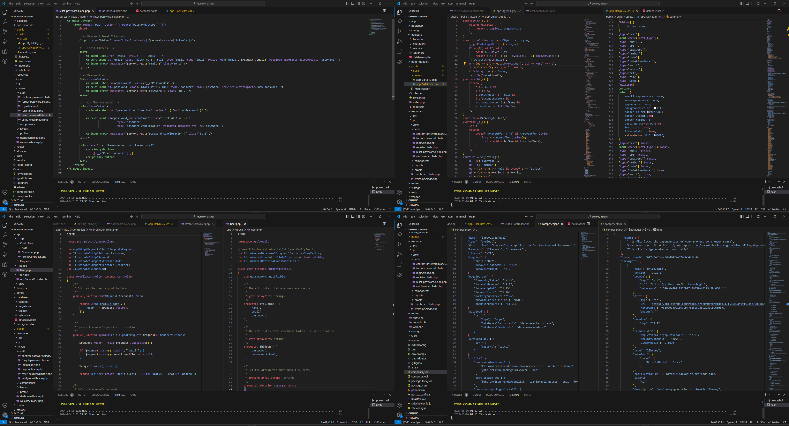
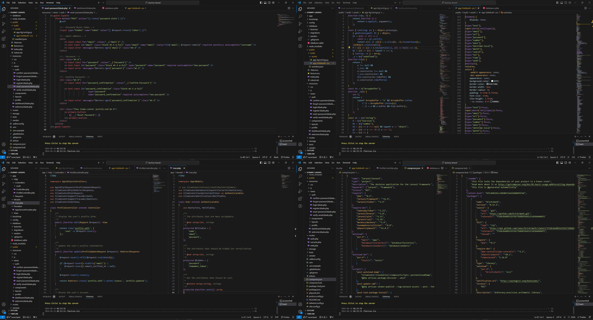

# Buzzokai Dimmed

**Buzzokai Dimmed** is a dark color theme for code editors that brings a dimmer but still vibrant versions of the classic and popular color themes. It's a fork of multiple themes, including the default "Monokai", "Material", "Github", "Dark Modern", etc. tailored to reduce eye strain during long coding sessions.
**See the Screenshots below**

## Features

- **Dimmed color Palettes**: Enjoy the most popular color palettes with a darker twist for a more comfortable coding experience.
- **Syntax Highlighting**: Carefully selected syntax highlighting that stands out on the dimmed background.
- **Wide Language Support**: Whether you're writing JavaScript, Python, or any other language, Buzzokai Dimmed has got you covered.
- **Customizable**: Fork and tweak it to your liking. Contributions are welcome!

## Installation

1. Open your code editor's extension marketplace.
2. Search for "Buzzokai Dimmed".
3. Install the extension and set the theme that suits you the most as your default.

## Feedback

We value your feedback and suggestions to improve this extension. For any issues or suggestions or other feedback, please visit my github issues and discussion page.

[@Issues](https://github.com/HRIDOY-BUZZ/buzzokai-dimmed/issues)

[@Discussions](https://github.com/HRIDOY-BUZZ/buzzokai-dimmed/discussions)

## Review and Ratings

If you find this extension helpful, please consider leaving a review in the [Visual Studio Code Marketplace](https://marketplace.visualstudio.com/items?itemName=HRIDOY-BUZZ.buzzokai-dimmed). Your reviews help us reach more users and improve the extension.

### How to Leave a Review

1. **Visit the Extension Page:** Go to the [VS Code Marketplace page](https://marketplace.visualstudio.com/items?itemName=HRIDOY-BUZZ.buzzokai-dimmed) for this extension.
2. **Sign In:** Make sure you are signed in. You can use your microsoft account to sign in.
3. **Rate and Review:** Click on the "Review" tab, rate the extension, and leave a review.

**THANK YOU**

## Contributing

If you'd like to contribute to the development of Buzzokai Dimmed, please fork the repository and submit a pull request with your changes.

## License

This theme is released under the MIT License. See LICENSE for details.

## Acknowledgments

- Inspired by the existing popular VS Code themes.
- A nod to the Modern themes for its modern take on the eye-soothing color pallate.

Enjoy coding with a theme that's easy on the eyes - **Buzzokai Dimmed**.

**Enjoy!**

# Screenshots

## Buzzokai Mono Dimmed

## Buzzokai Reversed Dimmed

## Buzzokai GitHub Dimmed

## Buzzokai Material Dimmed

